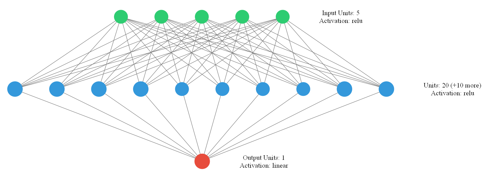
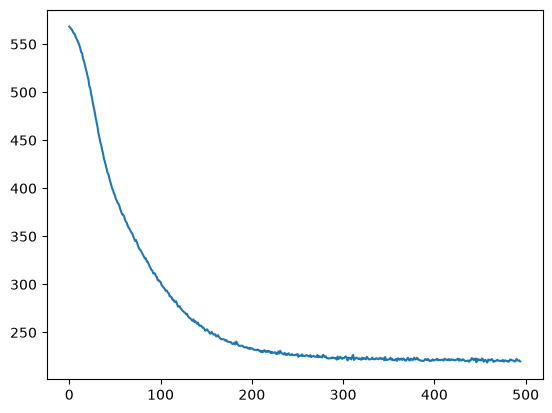

# CO₂ Emission Prediction using Deep Learning

Predicting CO₂ emissions using a **Deep Neural Network (DNN)** built with **TensorFlow/Keras**. This project demonstrates how deep learning can model complex relationships between multiple input features and CO₂ emissions using a large dataset.

 

## Overview

This project trains a feedforward neural network to predict CO₂ emissions from five input features. The model is implemented using **TensorFlow/Keras** and trained on a dataset containing more than **7,300 samples**.

The goal of this project is to compare a deep learning solution with a traditional machine learning approach and understand how neural networks perform on larger datasets.

 

## Features

* 🧠 Deep Neural Network using TensorFlow/Keras
* 📊 Regression model for CO₂ emission prediction
* 📁 Large dataset (7,300+ samples)
* 📈 Training loss visualization
* 📉 Mean Squared Error (MSE) evaluation
* 🔍 Model architecture visualization
* ⚡ Adam optimizer
* 📚 Clean and beginner-friendly implementation

 

## Technologies Used

* Python 3
* TensorFlow / Keras
* Pandas
* Scikit-learn
* Matplotlib
* keras-visualizer


## Dataset

The dataset contains **more than 7,300 samples** and **five input features** used to predict CO₂ emissions.

Example workflow:

* Load the dataset using Pandas
* Separate features and target values
* Split the data into training and testing sets
* Train the neural network
* Evaluate prediction accuracy
 

## Neural Network Architecture

```
Input Layer (5 Features)
        │
        ▼
Dense Layer (20 neurons, ReLU)
        │
        ▼
Output Layer (1 neuron)
```

### Model Summary

| Layer  | Units | Activation |
|    |  -: |    - |
| Input  |     5 | -          |
| Dense  |    20 | ReLU       |
| Output |     1 | Linear     |


## Training Configuration

| Parameter        |                    Value |
|      - |        --: |
| Optimizer        |                     Adam |
| Loss Function    | Mean Squared Error (MSE) |
| Epochs           |                      200 |
| Batch Size       |                  Default |
| Train/Test Split |                80% / 20% |


## Project Structure

```text
CO2-Emission-Prediction-Deep-Learning/
│
├── co2.csv
├── co2 prediction.ipynb
├── model_DL.png
├── screenshots/
│   ├── model.png
│   └── loss.png
├── requirements.txt
├── LICENSE
└── README.md
```
 

## Installation

Clone the repository:

```bash
git clone https://github.com/Matin-python/CO2-Emission-Prediction-Deep-Learning.git
```

Move into the project directory:

```bash
cd CO2-Emission-Prediction-Deep-Learning
```

Install the required packages:

```bash
pip install -r requirements.txt
```

or install manually:

```bash
pip install tensorflow pandas scikit-learn matplotlib keras-visualizer
```

## How to Run

```bash
python co2 prediction.ipynb
```

The program will:

1. Load the dataset.
2. Build the neural network.
3. Train the model.
4. Predict CO₂ emissions.
5. Evaluate the model using Mean Squared Error.
6. Plot the training loss.
7. Save a visualization of the network architecture.
 

## Results

The project reports:

* Mean Squared Error (MSE)
* Final training loss
* Training loss curve

These metrics help evaluate the performance of the neural network.


## Screenshots

### Neural Network Architecture



### Training Loss



 
## Related Projects

This project is part of a series exploring different approaches to CO₂ emission prediction.

### 📈 CO₂ Emission Prediction using Linear Regression

A traditional machine learning implementation using **Linear Regression** from **scikit-learn**.

**Comparison**

| Linear Regression        | Deep Learning                        |
|          |              |
| Machine Learning         | Deep Learning                        |
| Linear Regression        | Neural Network                       |
| 500 samples              | 7,300+ samples                       |
| 3 input features         | 5 input features                     |
| Fast training            | Longer training time                 |
| Simple and interpretable | Can model more complex relationships |

The Linear Regression project demonstrates how a traditional regression algorithm performs on a smaller dataset, while this project shows how a neural network can learn from a larger dataset with more input features.

➡️ **Repository:** https://github.com/Matin-python/CO2-Emission-Prediction-Linear-Regression


## Future Improvements

* 📊 Feature normalization
* 🎯 Hyperparameter tuning
* 🧠 Deeper neural network architectures
* 🔄 Cross-validation
* 📈 Additional evaluation metrics (MAE, R²)
* 💾 Save and load trained models
* ⚡ Early stopping
* 📉 TensorBoard visualization
* 🔍 Automatic hyperparameter optimization
* 🌐 Deploy the model as a web application


## Contributing

Contributions, suggestions, and improvements are welcome. Feel free to fork the repository and submit a pull request.


## License

This project is licensed under the MIT License.


## Author

**Mohammad Reza Bakhshandeh**

Electrical Engineering (Electronics) Graduate

Interested in Python Development, Machine Learning, Computer Vision, Artificial Intelligence, and Data Science.
